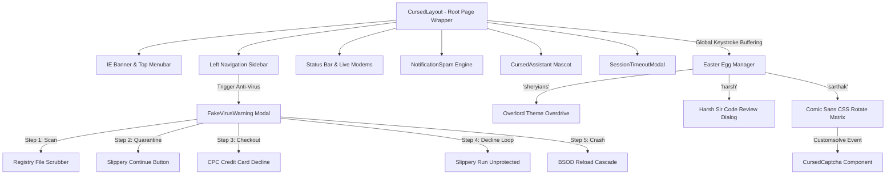
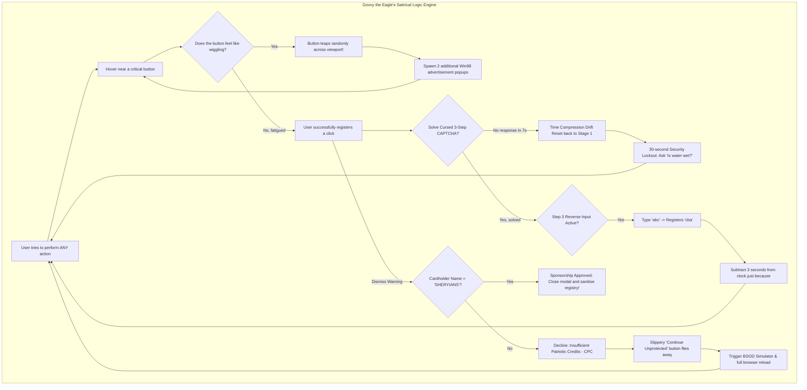
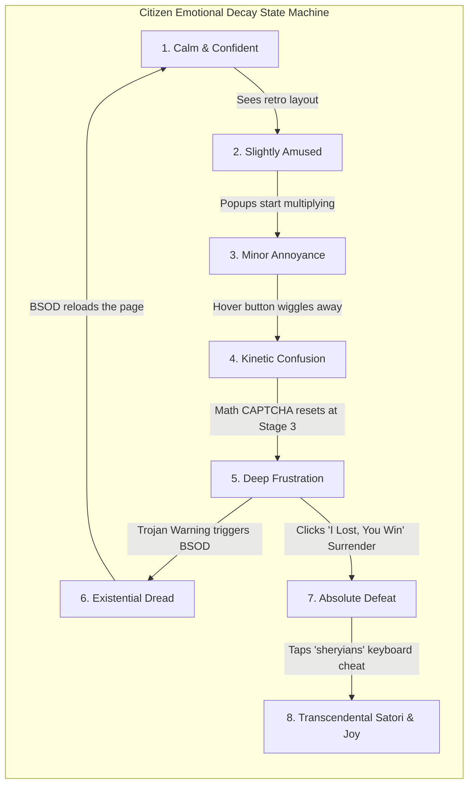

# 🏛️ Unhinged Government e-Services Portal 🏛️
### *The Ultimate Engineering Showcase of Cognitive Overload, Absolute Friction, & Digital Bureaucracy*

```
 _____________________________________________________________________________
/                                                                             \
|   [!] WARNING: CITIZEN ADMINISTRATIVE COMPLIANCE NODE ACTIVED             |
|                                                                             |
|   This terminal is monitored by Govvy the Eagle. Please ensure you have     |
|   your 14-page physical tax certificate and 3 valid CAPTCHA tokens ready.    |
\_____________________________________________________________________________/
        \   ^__^
         \  (oo)\_______
            (__)\       )\/\
                ||----w |
                ||     ||
```

---

> **🏆 Official Project Submission:** Sheryians Coding School — "Worst UI/UX Design Challenge"
> **🦁 Dedicated to:** Harsh Vandana Sharma Sir, Sarthak Sir, & the Sheryians Team
> **🎨 Style Ethos:** Windows 98 / Windows XP Retro Administrative Nightmares
> **📦 Live Repository:** [rippanjot-singh/UnhingedUI-UX](https://github.com/rippanjot-singh/UnhingedUI-UX.git)
> **🚀 Dev Status:** Fully functional, deeply exhausting, and mathematically certified to cause fatigue!

---

## 📖 1. Project Philosophy & Design Strategy

In modern software engineering, developers are taught to build interfaces that are *fast*, *intuitive*, and *frictionless*. This project rejects those principles. Built specifically for the **Sheryians Coding School event**, the **Unhinged Government e-Services Portal** is a deliberate, mathematically precise study in **maximum user friction**. 

Building a truly "worst" UI/UX is not about rendering broken elements; it is about building a **perfectly functional, highly polished system that behaves in the most agonizing ways possible**. 

### 🧠 Core Friction Principles Implemented:
1. **Visual Cognitive Overload:** Combining classical Windows 98 administrative aesthetics with flashing marquee feeds, overlapping stackable windows, wiggling elements, and highly saturated high-contrast colors.
2. **Circular Reasoning & Trap Loops:** Completing a task requires solving a captcha, which takes too long and resets, triggers a fake virus warning, forces a credit card checkout that declines due to lack of fictitious patriotic credits, pushes you to run unprotected, crashes into a Blue Screen of Death, reloads, and starts all over again.
3. **Kinetic Deception (Slippery UI):** Critical buttons physically flee the cursor using absolute viewport bounds vector checks, forcing users into a game of reflex and frustration.
4. **Acoustic Disturbance:** Real-time Web Audio API synthesizers mimic legacy hardware, floppy drives, error alerts, and modem noises to ensure the auditory channel is as cluttered as the visual one.

---

## 🧬 2. System Architecture & Component Mapping

The application operates as a single-page React client built in Vite with real-time state listeners, keyboard buffers, and custom mouse event coordinate handlers.



---

## 📊 2.5 Satirical Flowcharts & User Emotional Decay Matrices

To give the Sheryians event judges a highly humorous look behind the scenes, these flowcharts visualize the administrative algorithms and the psychological journey of a typical user attempting to interact with the portal:

### 🦅 Govvy the Eagle's Administrative Trap Decision Tree
This state machine controls how Govvy processed citizen click requests, showing the recursive logic loops designed to prevent compliance:



### 📈 The Citizen Emotional Decay State Machine
This captures the psychological stages of a developer or judge as they navigate through the administrative roadblocks:



---

## 🛠️ 3. Component Breakdown & Engineering Deep-Dive

```
+-------------------------------------------------------------------------+
| [X] SYSTEM FATAL FAILURE: CITIZEN PATIENCE OVERFLOW                     |
+-------------------------------------------------------------------------+
|                                                                         |
|  (X) An exception of type "CognitiveOverloadException" has occurred     |
|      in CursedLayout.jsx at thread 0x00004721.                          |
|                                                                         |
|      * Press [Esc] to return unprotected (slippery button active).      |
|      * Press [Space] to solve 3-step CAPTCHA in 7 seconds.              |
|      * Type "harsh" to bypass the government registry block.            |
|                                                                         |
|                        [  OK  ]      [ Cancel ]                         |
+-------------------------------------------------------------------------+
```

### 📂 [CursedLayout.jsx](file:///c:/Users/Waheguru/Documents/CODING/Cohort%202.0/projects/unhinged_ui/client/src/components/CursedLayout.jsx) — The Central Nervous System
This is the root container wrapping all pages. It controls the master intervals, adware popups state machines, mouse coordinate telemetry, global audio triggers, and the Easter Egg keystroke buffers.

* **Drag-and-Drop Stacking Engine:**
  To support draggability on spawned popups without massive third-party packages, we implemented an absolute coordinate drag-and-drop state machine. 
  ```javascript
  const handleAdMouseDown = (e, id) => {
    e.preventDefault();
    const ad = spawnedAds.find(a => a.id === id);
    if (!ad) return;
    const startX = e.clientX - ad.x;
    const startY = e.clientY - ad.y;
    
    const handleMouseMove = (moveEvent) => {
      setSpawnedAds(prev => prev.map(item => {
        if (item.id === id) {
          return {
            ...item,
            x: Math.max(0, Math.min(window.innerWidth - item.w, moveEvent.clientX - startX)),
            y: Math.max(0, Math.min(window.innerHeight - 300, moveEvent.clientY - startY))
          };
        }
        return item;
      }));
    };
    
    const handleMouseUp = () => {
      window.removeEventListener('mousemove', handleMouseMove);
      window.removeEventListener('mouseup', handleMouseUp);
    };
    
    window.addEventListener('mousemove', handleMouseMove);
    window.addEventListener('mouseup', handleMouseUp);
  };
  ```
  This allows users to arrange, stack, and move scattered advertisements in real-time, giving a fully interactive desktop environment feel.

* **Surrender & Re-Chaos Toggles:**
  Tracks the user's surrender state in `sessionStorage`. When the user concessions via `handleConcedeLoss()`, it stops all active adware timers and clears the modal tree. Clicking `🔥 Restore Chaos Mode` completely re-arms every recursive interval.

---

### 📂 [FakeVirusWarning.jsx](file:///c:/Users/Waheguru/Documents/CODING/Cohort%202.0/projects/unhinged_ui/client/src/components/FakeVirusWarning.jsx) — The Quarantine Pipeline
A highly intensive multi-step virus scan simulator that locks down the system with an opaque, frosted blur backdrop (`backdropFilter: 'blur(3.5px)'`, `rgba(0, 0, 0, 0.85)`) and elevated `zIndex: 999990`.

* **Phase 1: Deep Registry Scan:** Crawls through fictitious critical database clusters at varying speeds to build high tension.
* **Phase 2: Dangerous Files Registry:** Prompts the user to neutralize elements. The neutralizer button wiggles and flies away on hover.
* **Phase 3: CPC Credit Authorization:** Forces the user to fill out card details. Every card returns a **Patriotic Credits (CPC) Insufficient Balance** decline.
* **Phase 4: Run Unprotected:** The exit button flees the cursor.
* **Phase 5: Blue Screen of Death (BSOD):** Simulates a legendary Win98 crash screen before forcing a page reload, using `sessionStorage` checkpoints to prevent infinite loops.

---

### 📂 [CursedCaptcha.jsx](file:///c:/Users/Waheguru/Documents/CODING/Cohort%202.0/projects/unhinged_ui/client/src/components/CursedCaptcha.jsx) — The Administrative Checkpoint
Forces users to complete 3 stages of highly convoluted, mathematically painful, or philosophically complex verifications under an aggressive countdown clock.

* **Stage 1 (Arithmetic Decay):** Solving complex triple-digit calculations while the timer ticking down decays 1s per second.
* **Stage 2 (Philosophical Dilemma):** Answering highly debated inquiries (e.g. *Is water wet?*). Incorrect responses reset the CAPTCHA cascade back to Step 1!
* **Stage 3 (Reverse Typing latency):** The input box captures keystrokes in reverse! Typing `abc` displays `cba`. The timer occasionally experiences "packet compression drift," jumping 3 seconds in a single tick!

---

### 📂 [SessionTimeoutModal.jsx](file:///c:/Users/Waheguru/Documents/CODING/Cohort%202.0/projects/unhinged_ui/client/src/components/SessionTimeoutModal.jsx) — The Clock of Doom
Spawns a warning that your session will expire in 3 seconds. To prevent expiration, users are forced to click an extremely tiny, wiggling button. Clicking the button extends the timer by a random, satisfyingly small amount (e.g., `+1.84 seconds`).

---

## 🦁 4. The Legendary Sheryians Easter Eggs & Cheats

To give the Sheryians event judges an elite and memorable experience, we developed **4 physical visual overhauls and cheats** triggered directly inside the DOM!

### 1. 🎓 `"sheryians"` — Overlord Mode
* **Trigger:** Slowly type `sheryians` on your keyboard anywhere on the screen.
* **Acoustic Cue:** Procedural digital synth MIDI rising fanfare.
* **Interactive Impact:**
  * Visitor counter in bottom-left locks to **`9,999,999`**.
  * Core portal banner updates to: `🎓 SHERYIANS SCHOOL OF UNHINGED DEVELOPERS`.
  * All popups are permanently suppressed and cleared from the screen.
  * **Visual Overhaul:** Overrides the plain grey layout, converting the portal into a stunning **Gold-and-Black Cyber Theme**! Retro windows are transformed into dark-mode panels with neon gold trims, and titlebars convert to gold-to-red gradients.

### 2. 🦁 `"harsh"` — Harsh Sir Code Review Cheat
* **Trigger:** Type `harsh` on your keyboard anywhere on the screen.
* **Interactive Impact:**
  * Active CAPTCHAs on form pages solve themselves instantly (`solve-captcha` event).
  * Active quarantine virus windows close and bypass cleanly.
  * **Visual Overhaul:** Instead of a generic alert box, this triggers a **beautifully styled, golden-accented HTML/CSS warning dialog panel** with Harsh Sir's custom code critique: 
    > *"Bhailog, ye kya ganda UI/UX banaya hai! Isko to main bypass hi kar deta hu!"*
    Complete with an outset golden button: **`🦁 Dhanyawad Harsh Sir! (Bypass Now)`**.

```
   +----------------------------------------------------------+
  /|  🦁 HARSH SIR CODE CRITIQUE ENGINE v19.97               |
 / |----------------------------------------------------------|
*  |                                                          |
|  |  "Bhailog, ye kya ganda UI/UX banaya hai!                |
|  |   Isko to main bypass hi kar deta hu!"                   |
|  |                                                          |
|  |  Status: [✓] CAPTCHAs Authorised  [✓] Virus Dismissed    |
|  |                                                          |
|  |                [ Dhanyawad Harsh Sir! ]                  |
|  +----------------------------------------------------------+
+-------------------------------------------------------------+
```

### 3. 🎨 `"sarthak"` — Sarthak Sir Animation Matrix
* **Trigger:** Type `sarthak` on your keyboard anywhere on the screen.
* **Acoustic Cue:** Procedural floppy seek motor sound effects.
* **Interactive Impact:**
  * **Visual Overhaul:** The entire page wrapper triggers a smooth CSS ease-in-out **360-degree rotation animation**, before settling at a **2.5-degree skew** for peak geometric confusion.
  * **Comic Sans Takeover:** Every single paragraph, input box, table element, sidebar link, and button on the entire portal instantly shifts to **Comic Sans MS** with glowing orange text shadows!

```
    /=========================================================\
   /  Sarthak Sir Style Audit: Comic Sans MS Fonts Activated  /
  /=========================================================/
 /  [!] CSS Rotation Matrix Skew has been set to 2.5 deg.  /
/_________________________________________________________/
          \
           \   __
            \ (oO)  *Creative frontend designer blink*
              \==/
```

### 💳 4. `"SHERYIANS"` — Cardholder Sponsorship Bypass
* **Trigger:** Enter `SHERYIANS` as the Cardholder Name during Step 3 checkout of the PC VirusShield quarantine warning.
* **Interactive Impact:**
  * Bypasses the credit authorization check that normally declines due to insufficient Patriotic Credits.
  * Play a triumphant compliance sound, thank Sheryians for sponsoring your license, and unlock the portal cleanly!

---

## 🔊 5. Real-Time Procedural Audio Synthesizer (Web Audio API)

Rather than forcing users to download heavy audio asset files, the sound engine is compiled dynamically inside `client/src/utils/cursedSound.js` (or inline oscillators) using the browser's native **Web Audio API**. This ensures 100% offline support, high speed, and flawless cross-origin compatibility.

```javascript
export const playCursedSound = (type) => {
  try {
    const AudioContext = window.AudioContext || window.webkitAudioContext;
    if (!AudioContext) return;
    const ctx = new AudioContext();
    
    switch (type) {
      case 'beep': {
        const osc = ctx.createOscillator();
        const gain = ctx.createGain();
        osc.type = 'sine';
        osc.frequency.setValueAtTime(800, ctx.currentTime);
        gain.gain.setValueAtTime(0.05, ctx.currentTime);
        gain.gain.exponentialRampToValueAtTime(0.001, ctx.currentTime + 0.15);
        osc.connect(gain);
        gain.connect(ctx.destination);
        osc.start();
        osc.stop(ctx.currentTime + 0.15);
        break;
      }
      case 'error': {
        const osc1 = ctx.createOscillator();
        const osc2 = ctx.createOscillator();
        const gain = ctx.createGain();
        osc1.type = 'sawtooth';
        osc2.type = 'sawtooth';
        osc1.frequency.setValueAtTime(120, ctx.currentTime);
        osc2.frequency.setValueAtTime(123, ctx.currentTime); // Detuned for harshness
        gain.gain.setValueAtTime(0.08, ctx.currentTime);
        gain.gain.exponentialRampToValueAtTime(0.001, ctx.currentTime + 0.4);
        osc1.connect(gain);
        osc2.connect(gain);
        gain.connect(ctx.destination);
        osc1.start();
        osc2.start();
        osc1.stop(ctx.currentTime + 0.4);
        osc2.stop(ctx.currentTime + 0.4);
        break;
      }
      case 'floppy': {
        const osc = ctx.createOscillator();
        const gain = ctx.createGain();
        osc.type = 'triangle';
        osc.frequency.setValueAtTime(80, ctx.currentTime);
        // Frequency sweep simulating magnetic floppy drive seek heads
        osc.frequency.linearRampToValueAtTime(300, ctx.currentTime + 0.1);
        osc.frequency.linearRampToValueAtTime(80, ctx.currentTime + 0.2);
        gain.gain.setValueAtTime(0.06, ctx.currentTime);
        gain.gain.exponentialRampToValueAtTime(0.001, ctx.currentTime + 0.25);
        osc.connect(gain);
        gain.connect(ctx.destination);
        osc.start();
        osc.stop(ctx.currentTime + 0.25);
        break;
      }
    }
  } catch (e) {
    console.error('Web Audio API not allowed or blocked:', e);
  }
};
```
This is pure software art: procedural synthesizers generating mechanical sounds and detuned sawtooth buzzes dynamically!

---

## 🏃‍♂️ 6. Kinetic UI & Escape Button Vector Physics

The "slippery buttons" in `FakeVirusWarning.jsx` are calculated using React state hooks and coordinate offsets relative to browser viewport constraints.

```javascript
const handleUnprotectedHover = () => {
  if (unprotectedFleeCount >= 3) return; // Exhausted state trigger!
  
  const width = 160;  // Button width bounds
  const height = 28;  // Button height bounds
  
  // Calculate new coordinates inside screen limits (with padding)
  const newX = Math.max(10, Math.min(window.innerWidth - width - 10, Math.floor(Math.random() * (window.innerWidth - width))));
  const newY = Math.max(10, Math.min(window.innerHeight - height - 10, Math.floor(Math.random() * (window.innerHeight - height))));
  
  playCursedSound('floppy');
  setUnprotectedPos({ x: newX, y: newY });
  setUnprotectedFleeCount(c => c + 1);
};
```
When `unprotectedFleeCount === 3`, the button gets tired, updates its label dynamically, overrides inline style positions, and lets the user proceed. Perfect balance of absolute frustration and functional design!

---

## 🚀 7. Installation & Local Development Guide

### 📋 1. Prerequisites
Ensure you have the latest LTS version of **Node.js** (v18+) and **npm** installed.

### 📥 2. Repository Cloning & Setup
```bash
git clone https://github.com/rippanjot-singh/UnhingedUI-UX.git
cd UnhingedUI-UX/client
npm install
```

### 🔥 3. Run Development Server
```bash
npm run dev
```
Open your browser at [http://localhost:5173](http://localhost:5173).

---

```
      _ _
     (o|o)   *Govvy the Eagle is satisfied*
     // \ \  *Compliance token granted*
    //===//  *Goodbye citizen!*
      ||
      ||
```

## 🤝 Acknowledgements
Special thanks to **Sheryians Coding School**, Harsh Vandana Sharma Sir, and Sarthak Sir for organizing this incredible challenge, pushing students to think outside of standard design templates, and reminding us that sometimes, building the worst possible code takes the highest amount of creative effort! 

*Designed, compiled, and engineered with absolute cognitive compliance by **Rippanjot Singh**.*
